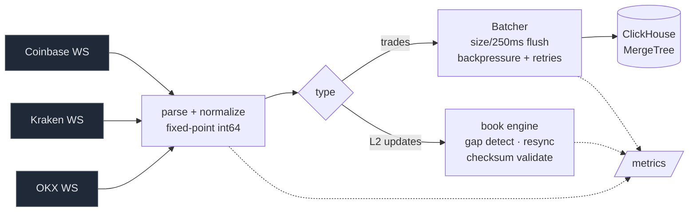

# tickstore

Multi-venue market data engine in Go: normalized exchange feeds, real-time order
book reconstruction with gap detection, and a ClickHouse tick store.

tickstore connects to **Coinbase, Kraken, and OKX** over their public
WebSockets, normalizes every venue's quirks into one canonical schema, rebuilds
L2 order books with per-venue integrity checks, and batches trades into
ClickHouse for analytics — with Prometheus metrics throughout.



## Highlights

- **No floats.** Prices and sizes are fixed-point `int64` end to end — exact
  equality, no drift. JSON numbers are parsed via `json.Number` so even numeric
  wire formats never touch `float64`.
- **One canonical schema** across three venues with genuinely different feeds:
  Coinbase reports the maker side (flipped to taker), Kraken sends numeric
  prices, OKX uses millisecond epochs — all absorbed at the normalization
  boundary.
- **Real order-book integrity, proven live.** Each venue exercises a different
  mechanism:

  | Venue    | Live book integrity                       |
  |----------|-------------------------------------------|
  | Coinbase | public feed has none → resync on reconnect |
  | Kraken   | **CRC32 checksum** validated every frame  |
  | OKX      | **seqId / prevSeqId** sequence gap detection |

  The venue-agnostic engine's own gap detection is covered by property tests
  (shuffled deltas and post-gap resync both converge to the reference).
- **Batched ClickHouse sink** — flush on size (10k) or 250 ms, bounded-channel
  backpressure, retry-until-shutdown, graceful flush on exit.
- **Reliable by construction** — per-venue reconnect with exponential backoff +
  full jitter, heartbeat/ping-backed read timeouts, and isolated goroutines so
  one venue failing can't take down the others.
- **Observable** — Prometheus metrics for messages, parse errors, trades, book
  gaps, resyncs, sink batch size, flush latency, and end-to-end latency.

## Quick start

Run the whole stack (ClickHouse + the app streaming all three venues):

```sh
docker compose up -d --build
curl localhost:9090/metrics            # app metrics
```

Query the trades landing in ClickHouse:

```sh
curl 'http://localhost:8123/?user=tickstore&password=tickstore' --data-binary "
  SELECT venue, symbol, count() AS trades,
         round(sum(toInt128(price)*size)/sum(toInt128(size))/1e8, 2) AS vwap
  FROM tickstore.trades GROUP BY venue, symbol ORDER BY venue, symbol"
```

Prices and sizes are stored as scale-8 `int64` (real value = stored / 1e8), so
aggregates cast to `Int128` first to avoid overflow.

### Without Docker

```sh
docker compose up -d clickhouse                          # just the DB
go run ./cmd/tickstore -config config.example.yaml       # all venues -> ClickHouse
go run ./cmd/tickstore -venue kraken -symbols BTC/USD    # single venue -> stdout
go run ./cmd/tickstore -book -venue kraken -symbols BTC/USD   # live top-of-book
```

## Configuration

`tickstore -config config.yaml` runs every listed venue concurrently into one
sink. Each venue uses its native symbol format.

```yaml
clickhouse:
  addr: clickhouse:9000   # empty -> print trades to stdout
  database: tickstore
  username: tickstore
  password: tickstore
sink:
  max_rows: 10000         # flush at this many rows...
  max_delay: 250ms        # ...or this often, whichever first
  buffer: 20000           # backpressure bound
metrics:
  addr: ":9090"           # /metrics; empty disables
venues:
  - { name: coinbase, symbols: [BTC-USD, ETH-USD] }
  - { name: kraken,   symbols: [BTC/USD, ETH/USD] }
  - { name: okx,      symbols: [BTC-USDT, ETH-USDT] }
```

## Measured numbers

From a local run of the full stack (all three venues, BTC + ETH majors). These
are short-sample, single-machine figures, not a 72-hour soak:

| Metric | Value |
|---|---|
| Sustained trades ingested | ~14 trades/s (market-driven; bursts higher) |
| End-to-end latency p50/p99 — Kraken | 10 ms / 108 ms |
| End-to-end latency p50/p99 — OKX | 99 ms / 192 ms |
| ClickHouse compression (trades) | ~2.1× on a ~3k-row sample (grows with volume) |
| Example VWAP/count query | ~4 ms |

**Latency caveat:** end-to-end latency is `ts_received − ts_exchange`, so it's
sensitive to clock skew between the local machine and the exchange. On this run
the local clock ran *ahead* of Coinbase, giving it a negative p50 — read these as
relative, not absolute. An NTP-disciplined clock is needed for true numbers.

## Metrics

`GET /metrics` exposes (all per-venue where applicable):
`tickstore_messages_total`, `tickstore_parse_errors_total`,
`tickstore_trades_total`, `tickstore_book_gaps_total`,
`tickstore_book_resyncs_total`, `tickstore_sink_batch_rows`,
`tickstore_sink_flush_seconds`, `tickstore_e2e_latency_seconds`.

## Layout

```
cmd/tickstore/      main: flags/config, lifecycle, graceful shutdown
internal/norm/      canonical types + fixed-point decimal parsing
internal/venue/     Venue/Handler interfaces, shared reconnect
    coinbase/       connector + level2 book
    kraken/         connector + book with CRC32 checksum
    okx/            connector + book with seqId gap detection
internal/book/      venue-agnostic L2 engine: apply, gap detect, resync
internal/sink/      ClickHouse batching writer
internal/metrics/   Prometheus collectors + /metrics
internal/config/    YAML config
```

## Testing

```sh
go test ./...                                            # unit + property tests
CLICKHOUSE_ADDR=127.0.0.1:9000 go test ./internal/sink/  # ClickHouse integration
```

Highlights: golden-file parser tests per venue, property tests for the book
engine (shuffled-replay and post-gap-resync convergence over randomized trials),
the CRC32 checksum verified offline against real captured Kraken snapshots, and a
round-trip fuzz test for the fixed-point codec.

## Design decisions

Every significant decision — and its trade-offs and alternatives — is recorded in
[docs/DECISIONS.md](docs/DECISIONS.md); the per-milestone narrative is in
[docs/milestones/](docs/milestones/).

## Non-goals (v1)

No trading or authenticated endpoints, no historical backfill beyond what resync
needs, no UI. Public market data only.
