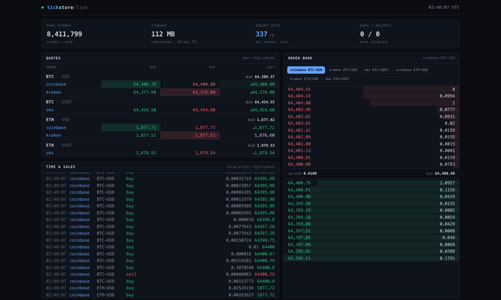
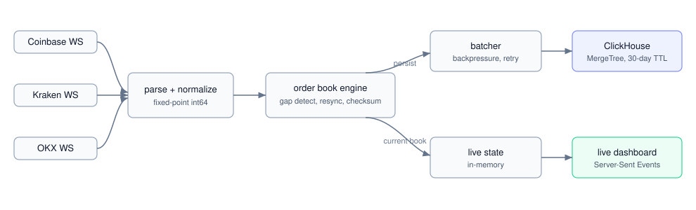

# tickstore

Multi-venue market data engine in Go: normalized exchange feeds, real-time order
book reconstruction with gap detection, a ClickHouse tick store, and a live
streaming dashboard. Runs 24/7 on a VPS.

**Live demo:** https://tickstore.alexeyelkin.com



*The live dashboard: cross-venue quotes, an order-book depth ladder, and time &
sales, streamed over Server-Sent Events.*

tickstore connects to **Coinbase, Kraken, and OKX** over their public
WebSockets, normalizes each venue's format into one schema, rebuilds L2 order
books with per-venue integrity checks, and batches trades into ClickHouse. It
exposes Prometheus metrics, can persist the full L2 order-book firehose, and
serves a live web dashboard (cross-venue quotes, a depth ladder, and time &
sales) over Server-Sent Events.



Trades and L2 book updates both flow through the batcher into ClickHouse. The
reconstructed book also feeds the live dashboard from in-memory state.

## Highlights

- **No floats.** Prices and sizes are fixed-point `int64` throughout, so equality
  is exact and there is no drift. JSON numbers are parsed with `json.Number`, so
  numeric wire formats never touch `float64`.
- **One schema across three different feeds.** Coinbase reports the maker side
  (flipped to taker), Kraken sends numeric prices, OKX uses millisecond epochs.
  All of it is handled at the normalization boundary.
- **Per-venue order-book integrity.** Each venue checks correctness a different
  way:

  | Venue    | Live book integrity                          |
  |----------|----------------------------------------------|
  | Coinbase | public feed has none; resync on reconnect    |
  | Kraken   | **CRC32 checksum** validated every frame     |
  | OKX      | **seqId / prevSeqId** sequence-gap detection |

  The venue-agnostic engine's own gap detection is covered by property tests:
  shuffled deltas and post-gap resync both converge to the reference book.
- **Batched ClickHouse sink.** Flushes on size (10k rows) or 250 ms, with
  bounded-channel backpressure, retry until shutdown, and a graceful flush on
  exit.
- **Reconnect and isolation.** Per-venue reconnect with exponential backoff and
  full jitter, heartbeat-backed read timeouts, and isolated goroutines so one
  venue failing does not take down the others.
- **Metrics.** Prometheus counters and histograms for messages, parse errors,
  trades, book gaps, resyncs, sink batch size, flush latency, and end-to-end
  latency.
- **Order-book firehose (opt-in).** The full L2 book can be persisted to a
  `book_updates` table, about 0.6 GB/day, bounded by a 30-day `TTL`. Off by
  default because it is roughly 1000x the volume of trades.
- **Live dashboard.** A self-contained web UI (cross-venue quote grid, depth
  ladder, time & sales tape) that reads the engine's in-memory book state and
  streams over Server-Sent Events instead of polling.

## Quick start

Run the whole stack (ClickHouse plus the app streaming all three venues):

```sh
docker compose up -d --build
curl localhost:9090/metrics            # app metrics
```

Query the trades landing in ClickHouse:

```sh
curl 'http://localhost:8123/?user=tickstore&password=tickstore' --data-binary "
  SELECT venue, symbol, count() AS trades,
         round(sum(toInt128(price)*size)/sum(toInt128(size))/1e8, 2) AS vwap
  FROM tickstore.trades GROUP BY venue, symbol ORDER BY venue, symbol"
```

Prices and sizes are stored as scale-8 `int64` (real value = stored / 1e8), so
aggregates cast to `Int128` first to avoid overflow.

### Without Docker

```sh
docker compose up -d clickhouse                          # just the DB
go run ./cmd/tickstore -config config.example.yaml       # all venues -> ClickHouse
go run ./cmd/tickstore -venue kraken -symbols BTC/USD    # single venue -> stdout
go run ./cmd/tickstore -book -venue kraken -symbols BTC/USD   # live top-of-book
```

## Configuration

`tickstore -config config.yaml` runs every listed venue concurrently into one
sink. Each venue uses its native symbol format.

```yaml
clickhouse:
  addr: clickhouse:9000   # empty -> print trades to stdout
  database: tickstore
  username: tickstore
  password: tickstore
sink:
  max_rows: 10000         # flush at this many rows...
  max_delay: 250ms        # ...or this often, whichever first
  buffer: 20000           # backpressure bound
metrics:
  addr: ":9090"           # /metrics; empty disables
dashboard:
  addr: ":8080"           # live web dashboard; empty disables
persist_books: false      # also record the full L2 firehose (30-day TTL)
venues:
  - { name: coinbase, symbols: [BTC-USD, ETH-USD] }
  - { name: kraken,   symbols: [BTC/USD, ETH/USD] }
  - { name: okx,      symbols: [BTC-USDT, ETH-USDT] }
```

## Live dashboard

With `dashboard.addr` set, tickstore serves a self-contained dashboard (no
external assets, no build step). It reads the engine's in-memory book state, so
it stays readable regardless of feed volume, and pushes updates over a single
Server-Sent Events connection instead of polling.

- **Quotes:** best bid/ask per venue, grouped by market, best-across-venues
  highlighted, with a live last-trade tick.
- **Order book:** a depth ladder with cumulative-size bars for a selected market.
- **Time & sales:** the trade tape, with large prints highlighted.
- **Health:** total rows, storage, live insert rate, and book gaps/resyncs.

By default it binds to localhost, so reach it over an SSH tunnel:

```sh
ssh -L 8080:localhost:8080 user@your-server   # then open http://localhost:8080
```

To serve it publicly, set `DASHBOARD_DOMAIN` in `.env` (a domain with an A record
pointing at the server) and start the included Caddy proxy, which terminates
HTTPS and forwards only the dashboard:

```sh
docker compose --profile public up -d
```

## Deploying to a VPS

The stack runs 24/7 on a small box (about $5/month). Data persists in a named
volume and the containers restart on reboot. About 2 GB RAM is comfortable;
trades store at roughly 1 GB/month.

On a fresh Ubuntu server with Docker installed:

```sh
git clone https://github.com/elkinal/tickstore.git && cd tickstore
cp .env.example .env
# edit .env: set a real CLICKHOUSE_PASSWORD
docker compose up -d --build
```

The app reconnects, retries, and restarts on its own. Useful checks:

```sh
docker compose ps              # containers up; clickhouse healthy
docker compose logs -f tickstore
```

**Security.** By default the app, ClickHouse, and metrics bind to `127.0.0.1`,
so nothing is exposed on the public internet; reach them over an SSH tunnel:

```sh
ssh -L 9090:localhost:9090 -L 8123:localhost:8123 user@your-server
# then locally: curl localhost:9090/metrics
```

The optional Caddy proxy (`--profile public`) is the only service that faces the
internet, and it exposes just the dashboard over HTTPS. ClickHouse and metrics
stay private.

**Persistence and storage.** ClickHouse data lives in the `clickhouse-data`
volume and survives restarts. Trades are about 1 GB/month for the default six
symbols and are kept for 90 days (their own TTL). The full L2 firehose can also be persisted to `book_updates` by setting
`persist_books: true`. It is off by default because books are far higher volume
than trades (measured about 500 book updates/sec versus a few trades/sec across
the six default symbols). ClickHouse compresses them to about 13 bytes/row, so
the firehose runs about 0.6 GB/day; with the 30-day TTL (keyed on `ts_received`)
that settles around 18 GB, which fits the boot disk. A dedicated volume gives
room to add venues or symbols.

**Updating.** `git pull && docker compose up -d --build`.

## Measured numbers

From a local run of the full stack (all three venues, BTC and ETH majors). These
are short-sample, single-machine figures, not a 72-hour soak.

| Metric | Value |
|---|---|
| Sustained trades ingested | ~14 trades/s (market-driven; bursts higher) |
| End-to-end latency p50/p99, Kraken | 10 ms / 108 ms |
| End-to-end latency p50/p99, OKX | 99 ms / 192 ms |
| ClickHouse compression (trades) | ~2.1x on a ~3k-row sample (grows with volume) |
| Example VWAP/count query | ~4 ms |

**Latency caveat.** End-to-end latency is `ts_received - ts_exchange`, so it is
sensitive to clock skew between the local machine and the exchange. On this run
the local clock ran ahead of Coinbase, giving it a negative p50, so read these as
relative, not absolute. True numbers need an NTP-disciplined clock.

## Metrics

`GET /metrics` exposes (per-venue where applicable):
`tickstore_messages_total`, `tickstore_parse_errors_total`,
`tickstore_trades_total`, `tickstore_book_gaps_total`,
`tickstore_book_resyncs_total`, `tickstore_sink_batch_rows`,
`tickstore_sink_flush_seconds`, `tickstore_e2e_latency_seconds`.

`messages_total` and `parse_errors_total` count the trade feeds; book-feed
integrity is tracked by `book_gaps_total` / `book_resyncs_total` (Kraken and OKX,
which expose a checksum / sequence). `e2e_latency_seconds` is `ts_received -
ts_exchange` (receipt vs exchange timestamp), so it is sensitive to clock skew.

## Layout

```
cmd/tickstore/      main: flags/config, lifecycle, graceful shutdown
internal/norm/      canonical types + fixed-point decimal parsing
internal/venue/     Venue/Handler interfaces, shared reconnect
    coinbase/       connector + level2 book
    kraken/         connector + book with CRC32 checksum
    okx/            connector + book with seqId gap detection
internal/book/      venue-agnostic L2 engine: apply, gap detect, resync
internal/sink/      ClickHouse batching writer (trades + book_updates)
internal/live/      in-memory current book + tape for the dashboard
internal/dashboard/ SSE server + self-contained live web UI
internal/metrics/   Prometheus collectors + /metrics
internal/config/    YAML config
```

## Testing

```sh
go test ./...                                            # unit + property tests
CLICKHOUSE_ADDR=127.0.0.1:9000 go test ./internal/sink/  # ClickHouse integration
```

Coverage includes golden-file parser tests per venue, property tests for the book
engine (shuffled-replay and post-gap-resync convergence over randomized trials),
the CRC32 checksum verified offline against real captured Kraken snapshots, and a
round-trip fuzz test for the fixed-point codec.

## Design decisions

Every significant decision, with its trade-offs and alternatives, is recorded in
[docs/DECISIONS.md](docs/DECISIONS.md). The per-milestone narrative is in
[docs/milestones/](docs/milestones/).

## Non-goals

No trading, order placement, or authenticated/private endpoints, and no
historical backfill beyond what a resync needs. Public market data only. The
dashboard is read-only; it binds to localhost by default and is exposed publicly
only through the optional Caddy proxy.
