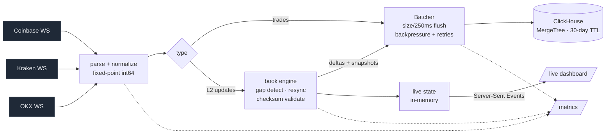

# tickstore

Multi-venue market data engine in Go: normalized exchange feeds, real-time order
book reconstruction with gap detection, a ClickHouse tick store, and a live
streaming dashboard — running 24/7 on a VPS.

tickstore connects to **Coinbase, Kraken, and OKX** over their public
WebSockets, normalizes every venue's quirks into one canonical schema, rebuilds
L2 order books with per-venue integrity checks, and batches trades into
ClickHouse for analytics — with Prometheus metrics throughout. It can also
persist the full L2 order-book firehose, and serves a live web dashboard
(cross-venue quotes, a depth ladder, and time & sales) pushed over Server-Sent
Events.


```mermaid
flowchart LR
    CB[Coinbase WS]:::v --> P
    KR[Kraken WS]:::v --> P
    OK[OKX WS]:::v --> P
    P[parse + normalize<br/>fixed-point int64] --> T{type}
    T -->|trades| B[Batcher<br/>size/250ms flush<br/>backpressure + retries]
    T -->|L2 updates| E[book engine<br/>gap detect · resync<br/>checksum validate]
    E -->|deltas + snapshots| B
    E --> L[live state<br/>in-memory]
    B --> CH[(ClickHouse<br/>MergeTree · 30-day TTL)]
    L -->|Server-Sent Events| D[/live dashboard/]
    P -.-> M[/metrics/]
    E -.-> M
    B -.-> M
    classDef v fill:#1f2937,stroke:#4b5563,color:#e5e7eb;
```

## Highlights

- **No floats.** Prices and sizes are fixed-point `int64` end to end — exact
  equality, no drift. JSON numbers are parsed via `json.Number` so even numeric
  wire formats never touch `float64`.
- **One canonical schema** across three venues with genuinely different feeds:
  Coinbase reports the maker side (flipped to taker), Kraken sends numeric
  prices, OKX uses millisecond epochs — all absorbed at the normalization
  boundary.
- **Real order-book integrity, proven live.** Each venue exercises a different
  mechanism:

  | Venue    | Live book integrity                       |
  |----------|-------------------------------------------|
  | Coinbase | public feed has none → resync on reconnect |
  | Kraken   | **CRC32 checksum** validated every frame  |
  | OKX      | **seqId / prevSeqId** sequence gap detection |

  The venue-agnostic engine's own gap detection is covered by property tests
  (shuffled deltas and post-gap resync both converge to the reference).
- **Batched ClickHouse sink** — flush on size (10k) or 250 ms, bounded-channel
  backpressure, retry-until-shutdown, graceful flush on exit.
- **Reliable by construction** — per-venue reconnect with exponential backoff +
  full jitter, heartbeat/ping-backed read timeouts, and isolated goroutines so
  one venue failing can't take down the others.
- **Observable** — Prometheus metrics for messages, parse errors, trades, book
  gaps, resyncs, sink batch size, flush latency, and end-to-end latency.
- **Order-book firehose, opt-in.** The full L2 book (every level change) can be
  persisted to a `book_updates` table — ~0.6 GB/day — bounded by a 30-day
  `TTL`. Off by default since it's ~1000× the volume of trades.
- **Live streaming dashboard.** A self-contained web UI — cross-venue quote grid
  (best bid/ask per venue), an order-book depth ladder, and a time & sales tape —
  that reads the engine's **in-memory** book state and is pushed over
  **Server-Sent Events** (one connection, no polling).

## Quick start

Run the whole stack (ClickHouse + the app streaming all three venues):

```sh
docker compose up -d --build
curl localhost:9090/metrics            # app metrics
```

Query the trades landing in ClickHouse:

```sh
curl 'http://localhost:8123/?user=tickstore&password=tickstore' --data-binary "
  SELECT venue, symbol, count() AS trades,
         round(sum(toInt128(price)*size)/sum(toInt128(size))/1e8, 2) AS vwap
  FROM tickstore.trades GROUP BY venue, symbol ORDER BY venue, symbol"
```

Prices and sizes are stored as scale-8 `int64` (real value = stored / 1e8), so
aggregates cast to `Int128` first to avoid overflow.

### Without Docker

```sh
docker compose up -d clickhouse                          # just the DB
go run ./cmd/tickstore -config config.example.yaml       # all venues -> ClickHouse
go run ./cmd/tickstore -venue kraken -symbols BTC/USD    # single venue -> stdout
go run ./cmd/tickstore -book -venue kraken -symbols BTC/USD   # live top-of-book
```

## Configuration

`tickstore -config config.yaml` runs every listed venue concurrently into one
sink. Each venue uses its native symbol format.

```yaml
clickhouse:
  addr: clickhouse:9000   # empty -> print trades to stdout
  database: tickstore
  username: tickstore
  password: tickstore
sink:
  max_rows: 10000         # flush at this many rows...
  max_delay: 250ms        # ...or this often, whichever first
  buffer: 20000           # backpressure bound
metrics:
  addr: ":9090"           # /metrics; empty disables
dashboard:
  addr: ":8080"           # live web dashboard; empty disables
persist_books: false      # also record the full L2 firehose (30-day TTL)
venues:
  - { name: coinbase, symbols: [BTC-USD, ETH-USD] }
  - { name: kraken,   symbols: [BTC/USD, ETH/USD] }
  - { name: okx,      symbols: [BTC-USDT, ETH-USDT] }
```

## Live dashboard

With `dashboard.addr` set, tickstore serves a self-contained live dashboard (no
external assets or build step). It reads the engine's **in-memory** book state —
so it stays readable no matter how fast the feed runs — and pushes updates over a
single **Server-Sent Events** connection instead of polling:

- **Quotes** — best bid/ask per venue, grouped by market, best-across-venues
  highlighted, with a live last-trade tick.
- **Order book** — a depth ladder with cumulative-size bars for a selected market.
- **Time & sales** — the trade tape, large prints highlighted.
- **Health** — total rows, storage, live insert rate, and book gaps/resyncs.

It binds to localhost, so reach it over an SSH tunnel:

```sh
ssh -L 8080:localhost:8080 user@your-server   # then open http://localhost:8080
```

<!-- For the strongest first impression, add a screenshot:
       -->


## Deploying to a VPS

The full stack runs 24/7 on a small box (~$5/mo, or free on an Oracle Cloud
always-free ARM VM). Data persists in a named volume and everything restarts on
reboot. ~2 GB RAM is comfortable; trades store at roughly 1 GB/month.

On a fresh Ubuntu server with Docker installed:

```sh
git clone https://github.com/elkinal/tickstore.git && cd tickstore
cp .env.example .env
# edit .env: set a real CLICKHOUSE_PASSWORD
docker compose up -d --build
```

That's it — the app reconnects, retries, and restarts on its own. Useful checks:

```sh
docker compose ps              # both services up; clickhouse healthy
docker compose logs -f tickstore
```

**Security.** Ports bind to `127.0.0.1` only, so nothing is exposed on the public
internet. To reach `/metrics` or ClickHouse from your machine, tunnel over SSH:

```sh
ssh -L 9090:localhost:9090 -L 8123:localhost:8123 user@your-server
# then locally: curl localhost:9090/metrics
```

**Persistence & storage.** ClickHouse data lives in the `clickhouse-data` volume
and survives restarts. Trades are ~1 GB/month for the default six symbols. Full
L2 order books ("the firehose") can also be persisted to the `book_updates`
table by setting `persist_books: true` in the config — it's off by default
because books are far higher volume than trades (measured ~500 book updates/sec
vs. a few trades/sec across the six default symbols). ClickHouse compresses them
to ~13 bytes/row, so the firehose runs ~0.6 GB/day; with the table's 30-day TTL
(keyed on `ts_received`) that settles around ~18 GB steady state — which fits the
boot disk, though a dedicated volume gives room to add venues or symbols.

**Updating.** `git pull && docker compose up -d --build`.

### Server management shortcuts

A local helper script (`~/.tickstore.sh`, sourced from your shell rc; holds the
host + ClickHouse password, so it's kept out of git) wraps the common operations
as `ts-*` commands you run from your own machine over SSH:

| Command | Does |
|---|---|
| `ts` | SSH into the server |
| `ts-status` | container health |
| `ts-vwap` / `ts-count` | live VWAP / trade counts per symbol |
| `ts-feed` | live scrolling feed of trades as they arrive |
| `ts-dashboard` | open the live web dashboard in your browser |
| `ts-q "SQL"` | run any ClickHouse query |
| `ts-metrics` | Prometheus counters |
| `ts-logs` | follow the live app log |
| `ts-restart` / `ts-update` | restart the app / pull + rebuild + redeploy |
| `ts-tunnel` | expose the server's ClickHouse + metrics on localhost |
| `ts-help` | list them all |

## Measured numbers

From a local run of the full stack (all three venues, BTC + ETH majors). These
are short-sample, single-machine figures, not a 72-hour soak:

| Metric | Value |
|---|---|
| Sustained trades ingested | ~14 trades/s (market-driven; bursts higher) |
| End-to-end latency p50/p99 — Kraken | 10 ms / 108 ms |
| End-to-end latency p50/p99 — OKX | 99 ms / 192 ms |
| ClickHouse compression (trades) | ~2.1× on a ~3k-row sample (grows with volume) |
| Example VWAP/count query | ~4 ms |

**Latency caveat:** end-to-end latency is `ts_received − ts_exchange`, so it's
sensitive to clock skew between the local machine and the exchange. On this run
the local clock ran *ahead* of Coinbase, giving it a negative p50 — read these as
relative, not absolute. An NTP-disciplined clock is needed for true numbers.

## Metrics

`GET /metrics` exposes (all per-venue where applicable):
`tickstore_messages_total`, `tickstore_parse_errors_total`,
`tickstore_trades_total`, `tickstore_book_gaps_total`,
`tickstore_book_resyncs_total`, `tickstore_sink_batch_rows`,
`tickstore_sink_flush_seconds`, `tickstore_e2e_latency_seconds`.

## Layout

```
cmd/tickstore/      main: flags/config, lifecycle, graceful shutdown
internal/norm/      canonical types + fixed-point decimal parsing
internal/venue/     Venue/Handler interfaces, shared reconnect
    coinbase/       connector + level2 book
    kraken/         connector + book with CRC32 checksum
    okx/            connector + book with seqId gap detection
internal/book/      venue-agnostic L2 engine: apply, gap detect, resync
internal/sink/      ClickHouse batching writer (trades + book_updates)
internal/live/      in-memory current book + tape for the dashboard
internal/dashboard/ SSE server + self-contained live web UI
internal/metrics/   Prometheus collectors + /metrics
internal/config/    YAML config
```

## Testing

```sh
go test ./...                                            # unit + property tests
CLICKHOUSE_ADDR=127.0.0.1:9000 go test ./internal/sink/  # ClickHouse integration
```

Highlights: golden-file parser tests per venue, property tests for the book
engine (shuffled-replay and post-gap-resync convergence over randomized trials),
the CRC32 checksum verified offline against real captured Kraken snapshots, and a
round-trip fuzz test for the fixed-point codec.

## Design decisions

Every significant decision — and its trade-offs and alternatives — is recorded in
[docs/DECISIONS.md](docs/DECISIONS.md); the per-milestone narrative is in
[docs/milestones/](docs/milestones/).

## Non-goals

No trading, order placement, or authenticated/private endpoints, and no
historical backfill beyond what a resync needs — public market data only. The
dashboard is a read-only monitoring view, bound to localhost (reach it over an
SSH tunnel), not a public service.
